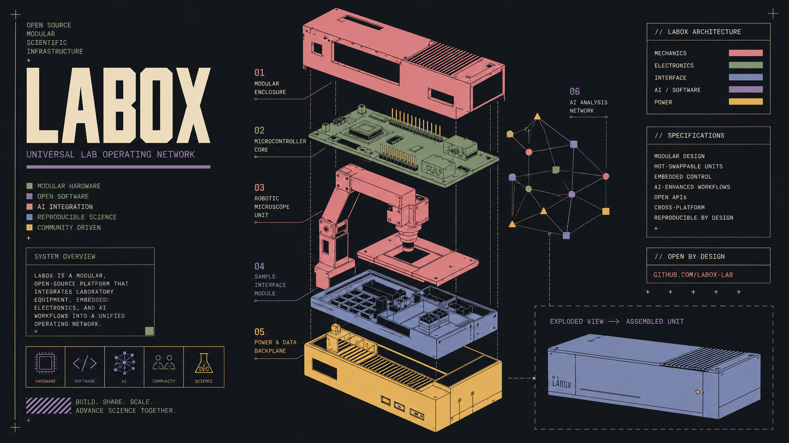

# Labox — Open Laboratory Automation & Experimentation Framework




## What is Labox?

Laboratory equipment is often isolated behind proprietary software, vendor-specific protocols, and incompatible interfaces.

A microscope speaks one language.

A sensor speaks another.

A microcontroller has its own firmware.

An analysis pipeline lives somewhere else.

Labox is an experimental open-source framework built to explore a different approach:

> **What if laboratory equipment, experiments, automation, and scientific analysis could be connected through a common, programmable software layer?**

Labox aims to provide a Python-based foundation for building laboratory automation and experimentation systems by connecting hardware, scientific data, computer vision, machine learning, and experimental workflows in a single ecosystem.

## What does it aim to do?

Labox is designed to explore the foundations of a more open and programmable laboratory environment.

* 🔬 Connect laboratory instruments and custom hardware through a common software architecture

* ⚙️ Control and monitor experimental systems using programmable workflows

* 🧪 Collect and process data from sensors, instruments, and experiments

* 📷 Capture and analyze scientific images using computer vision

* 🧠 Integrate machine learning models into experimental pipelines

* 🔌 Create abstractions over different hardware and communication interfaces

* 📊 Record, visualize, and analyze experimental data

* 🧩 Build modular systems that can be extended with new instruments, protocols, and analysis components

The long-term goal is not to build a single laboratory instrument.

The goal is to explore the possibility of an **open software layer for experimental systems**.

## From hardware to insight

A laboratory experiment may involve many independent components:

```text
┌──────────────┐
│   Sensors    │
└──────┬───────┘
       │
       ▼
┌──────────────┐
│ Microcontrol │
│   Hardware   │
└──────┬───────┘
       │
       ▼
┌──────────────┐
│ Communication │
│   Protocols   │
└──────┬───────┘
       │
       ▼
┌──────────────┐
│    Labox     │
│   Framework   │
└──────┬───────┘
       │
       ├──────────────► Data Collection
       │
       ├──────────────► Computer Vision
       │
       ├──────────────► Machine Learning
       │
       └──────────────► Experimental Analysis
```

Labox is intended to provide the software layer connecting these components.

A sensor reading should be usable by an analysis pipeline.

An image captured from a microscope should be able to become structured scientific data.

A hardware event should be able to trigger an experimental operation.

An analysis result should be able to become part of a reproducible experiment.

The objective is to make these interactions programmable, modular, and extensible.

## Why Labox?

Scientific experimentation increasingly depends on software, but laboratory software is often fragmented.

Researchers and engineers frequently need to combine:

* proprietary laboratory instruments
* custom electronics
* microcontrollers
* sensors
* cameras
* computer vision
* machine learning
* databases
* custom scripts

The result is often a collection of disconnected tools and one-off scripts.

Labox explores whether these systems can instead be built on top of a common open-source foundation.

Rather than forcing every experiment into a fixed workflow, Labox is intended to provide building blocks that can be combined into different experimental systems.

```text
Hardware
    ↓
Communication
    ↓
Data
    ↓
Processing
    ↓
Analysis
    ↓
Experiment
```

## Built for experimentation

Labox is intentionally experimental.

It is not intended to replace professional laboratory equipment, certified medical systems, or validated scientific software.

Instead, it is a framework for exploring how open-source software, embedded hardware, scientific computing, computer vision, and artificial intelligence can be combined to build new experimental systems.

A simple system may look like:

```text
Sensor
   ↓
Microcontroller
   ↓
Python
   ↓
Data Processing
   ↓
Analysis
```

A more advanced system may look like:

```text
Laboratory Hardware
        ↓
Data Acquisition
        ↓
Experimental Pipeline
        ↓
Computer Vision
        ↓
Machine Learning
        ↓
Scientific Analysis
```

The same underlying philosophy should support both.

## The long-term vision

The long-term vision of Labox is to become a modular open-source foundation for experimental systems.

Not a single instrument.

Not a single analysis tool.

Not a collection of unrelated scripts.

But an ecosystem where hardware, software, data, and scientific workflows can be connected through common abstractions.

The project is inspired by a simple idea:

> **Laboratories should be programmable.**

Labox is an exploration of what that could look like.

---

⚠️ **Labox is currently experimental and under active development. It should not be used for clinical diagnosis, medical treatment, safety-critical systems, or validated scientific decision-making.**

## Licensing

Labox is source-available software distributed under the **PolyForm Noncommercial License 1.0.0**.

You may use, study, modify, and distribute Labox for permitted noncommercial purposes, including personal projects, education, research, experimentation, and other uses covered by the license.

**Commercial use requires a separate commercial license.**

Commercial licensing may be required if Labox is:

* used as part of a commercial product or service;
* integrated into a commercial laboratory, research, or automation system;
* used to provide a paid hosted or managed service;
* distributed as part of a commercial software or hardware product; or
* used by a commercial organization for commercial purposes outside the permissions of the PolyForm Noncommercial License.

For commercial licensing inquiries, please contact the project maintainers.

See [`LICENSE.md`](LICENSE.md) for the complete license terms.

